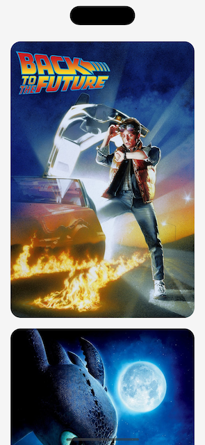

# CachedAsyncImage

[](https://github.com/apple/swift-package-manager)

Async image loading with cache for SwiftUI.

## Screenshots


## Installation
### [Swift Package Manager](https://swift.org/package-manager/)

Going to Xcode `File` > `Add Packages...` and add the repository by giving the URL `https://github.com/bullinnyc/CachedAsyncImage`  
Enjoy!

## Usage

```swift
import CachedAsyncImage
```

### Create placeholder and customize image

```swift
let exampleUrl = "https://example.com/image.jpg"

CachedAsyncImage(
    url: exampleUrl,
    placeholder: {
        // Create any view for placeholder.
        ZStack {
            Color.yellow
            ProgressView()
        }
    },
    image: {
        // Customize image.
        Image(uiImage: $0)
            .resizable()
            .scaledToFill()
    }
)
```

### Set image cache limit (optional)
**Note:** The default value is `0`, e.g. is no `countLimit` and is no `totalCostLimit`.

```swift
.onAppear {
    TemporaryImageCache.shared.setCacheLimit(
        countLimit: 1000, // 1000 items
        totalCostLimit: 1024 * 1024 * 200 // 200 MB
    )
}
```

## Requirements
- iOS 14.0 +
- [SwiftUI](https://developer.apple.com/xcode/swiftui/)

## License
- CachedAsyncImage is distributed under the MIT License.
